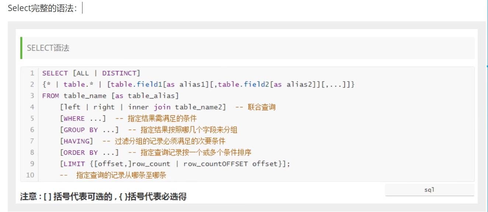
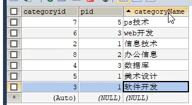
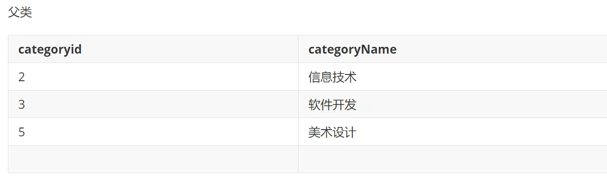
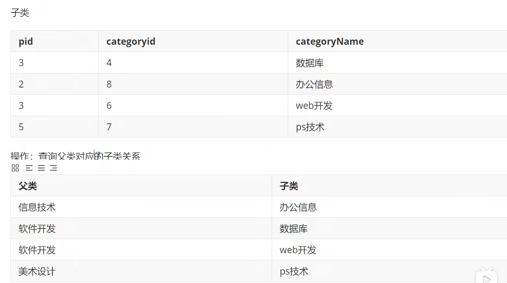
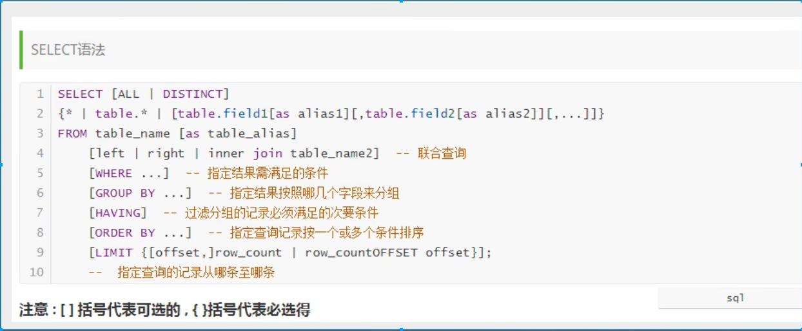
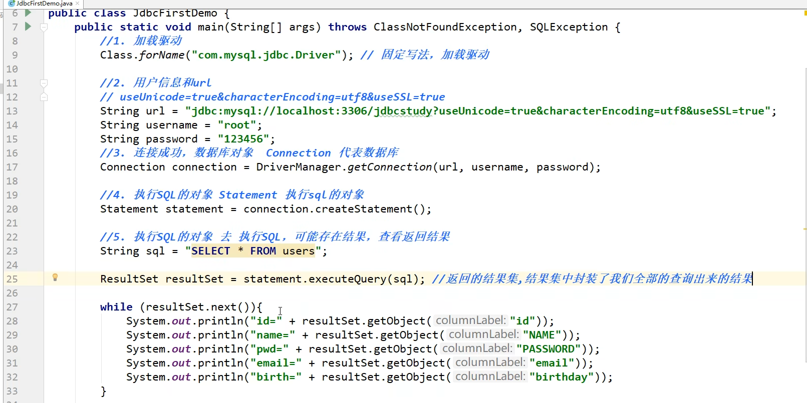
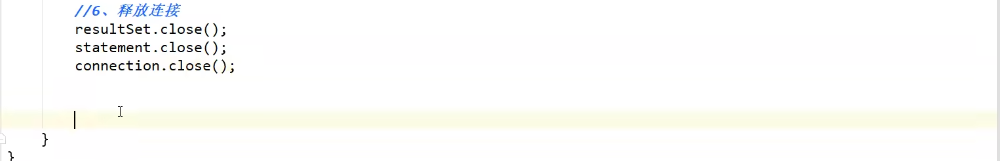

# 1 初识SQL

## 1.2 什么是数据库

数据库 database

概念： 数据仓库，软件，安装在操作系统上，SQL可以储存大量的数据

作用： 储存数据，管理数据

## 1.3 数据库分类

**关系型数据库：**（SQL）

- ​	MySQL,  Oravle，Sql Server， DB2， SQLite
- 通过表和表之间，行和列之间的关系进行数据的存储，如学员信息表，考勤表。。。


**非关系型数据库：**（NoSQL）not only sql

- redis， MongDB
- 非关系型数据库，对SQL象存储通过对象的自身属性来决定


**DBMS数据库管理系统**

- 数据的管理软件，科学有效的管理我们的数据。维护和获取数据
- MySQL，数据库管理系统


## 1.4 MySQL

登录：`mysql -h localhost -u root -p`

密码：fangrunbo0606

或者直接：`mysql -u root -pfangrunbo0606`， 退出用exit

管理员身份停止mysql：`net stop MySQL80`

管理员身份启动mysql：`net start MySQL80`

刷新权限： `flush privileges`

查看数据库： `show database;`

使用：`use xxxx`;

查看表：`show tables;`

看信息：`describe  xxxx;`

创建表：`create database xxxx;`

注释： `-- 单行注释`，`#`，`/*多行注释*/`

查看表：右键查看


DDL	数据库定义语言

DML	操作语言

DQL	查询语言

 DCL	控制语言


# 2 操作数据库

操作数据库 > 操作数据库中的表 > 操作数据库中表的数据

**MySQL不分大小写**

## 2.1 操作数据库（了解）

1 创建数据库

```sql
CREATE DATABASE [IF NO EXISTS] xxxx
```

2 删除数据库

```sql
DROP DATABASE [IF EXISTS] XXXX
```

3 使用数据库

```sql
USE `xxx`
SELECT `XXX` FROM XXX
```

4 查看数据库

```sql
SHOW DATABASE --查看所有数据库
```


## 2.2 数据库的列类型

```
数值：
```

1. tinyint 	          1 byte
2. smallint            2 byte
3. mediumint      3 byte
4. **int                     4 byte**
5. bigint                8 byte
6. float                  4 byte
7. double              8 byte
8. decimal            

```
字符串：
```

1. char                      0-255
2. **varchar                0-65535  常用的string**
3. tinytext                 2^8 - 1
4. text                        2^16 - 1  大文本

```
时间日期：
```

java.util.Date

​	date: YYYY-MM-DD， 日期格式

​	time: HH: mm: ss 时间格式

​	**datetime: YYYY-MM-DD HH: mm: ss 最常用格式**

​	**timestamp 时间戳，1970.1.1 到现在的毫秒数**

​	year

```
null：
```

​	没有值，未知

​	**不要使用null进行计算，结果也为null**


## 2.3 数据库的字段属性（重点）

**unsigned：** 

​	无符号的整数

​	声明了该列不能声明为负数

**zerofill:** 

​	0填充

**autoincrease:**

​	自增，必须为整数

**Not Null:**

​	不能为null

**default:**

​	默认

**每一个表都必须存在以下五个字段**

**id 主键; version 乐观锁; is_delete 伪删除; gmt_create 创建时间； gmt_update 修改时间**


## 2.4 创建数据库表

```sql
CREATE TABLE IF NOT EXISTS `student`(
	`id` INT(4) NOT NULL AUTO_INCREMENT COMMENT '学号',
	`name` VARCHAR(30) NOT NULL DEFAULT '匿名' COMMENT '姓名',
	`pwd` VARCHAR(20) NOT NULL DEFAULT '123456' COMMENT '密码',
	`sex` VARCHAR(2) NOT NULL DEFAULT '女' COMMENT '性别',
	`birthday` DATETIME DEFAULT NULL COMMENT '生日',
	`address` VARCHAR(100) DEFAULT NULL COMMENT '住址',
	`email` VARCHAR(50) DEFAULT NULL COMMENT '邮箱',
	PRIMARY KEY(`id`)
)ENGINE = INNODB DEFAULT CHARSET = utf8
```

格式

```sql
CREATE TABLE [IF NOT EXISTS] `表名`(
    `字段名` 列类型[属性][索引][注释],
    `字段名` 列类型[属性][索引][注释],
    ......
    `字段名` 列类型[属性][索引][注释],
    PRIMARY KEY(``)
)[表类型][字符集设置][注释]
```

常用命令

```sql
SHOW CREATE DATABASE SCHOOL --查看创建数据库的语句
SHOW CREATE TABLE student --查看student数据表的定义语句
DESC student --显示表的结构
```


## 2.5 数据表的类型

1. INNODB 默认使用
2. MyISAM 早些年使用

|            | MYISAM | INNODB      |
| ---------- | ------ | ----------- |
| 事务支持   | 不支持 | 支持        |
| 数据行锁定 | 不支持 | 支持        |
| 外键约束   | 不支持 | 支持        |
| 全文索引   | 支持   | 不支持      |
| 表空间大小 | 较小   | 较大，约2倍 |

常规使用操作：

​	MYISAM: 节约空间，速度快

​	INNODB: 安全性高，事务的处理，夺标多用户操作

```
在物理空间存在的位置
```

所有数据库文件都存在data目录下，一个文件夹对应一个数据库


MYSQL引擎物理文件上的区别：

​	INNODB在数据库表中只有一个*.frm文件，以及上级目录下的ibdata1文件

​	MYISAM对应文件

​		*.frm -表结构的定义文件

​		*.MYD 数据文件（data）

​		*.MYI	索引文件（index）

```sql
CHARSET = utf8
```

不设置的话是mysql默认的字符集编码


## 2.6 修改删除表

修改表：

```sql
ALTER TABLE XXX ADD / MODIFY / CHANGE / DROP / RENAME AS XXX
```

MODIFY是修改约束的， change是修改名的,  DROP 删除字段

删除表:

```sql
DROP TABLE IF EXISTS XXXX
```

所有创建和删除操作都加上判断以面报错


注意点：

​	`` 字段名

​	' '  varchar表内信息


# 3 MySQL数据管理

## 3.1 外键

定义外键key : key xxx(原本的键)

给外键添加约束 constraint `xxxx` FOREIGN KET `(原本的键)` REFERENCES `另一个表`(`字段`)


单独添加外键：

```sql
ALTER TABLE `student` ADD CONSTRAINT `FK_gradeid` FOREIGN KEY(`gradeid`) REFERENCES `grade` (`gradeid`);
```

都是物理外键，数据库级别的，不建议使用，删不掉东西，避免数据库过多造成困扰

**==最佳实践==**

**数据库就是单纯的表，只用来存数据，只有行和列**

**想使用多张表的数据，想使用外键，用程序去实现**


## 3.2 DML语言

**数据库的意义**：数据储存，数据管理

DML语言：数据操作语言

insert

update

delete


## 3.3 添加

```sql
INSERT INTO 表名([字段名1，字段名2，字段3]) values('值1'),('值2'),('值3')
INSERT INTO `grade`(`gradename`)values ('大四')
--主键自增我们可以省略
INSERT INTO `grade` values('大三')
--插入多个字段
INSERT INTO `grade`(`gradename`)
values('大一'),('大二')
```

注意：字段是可以省略的，但后面的值必须一一对应


## 3.4 修改

```sql
update 修改谁(条件) set 原值=新值
update `student` SET `name` = 'xxx' where id = 1;
--没有where的话会改所有的name
update `student` SET `name` = 'xxx',`email` = 'xxxxxx' where id = 1;
```

```sql
where后边可以跟 = <> != > < <= >= between...and...是闭区间 and or    
```

```sql
update 表名 set column_name = value where[条件] 
```

value可以是一个具体的值，也可以是变量


## 3.5 删除

```sql
delete from 表名 where 条件

truncate 表名  --完全清空一个表的数据，表的结构和索引不变，default还在--
```

>
>
>Delete 和truncate的区别

相同：都能删数据还不会删表结构

不同：

​		tuncate 重新设置自增列，计数器回归0， 不会影响事务


# 4 DQL 查询数据(最重点)

## 4.1 DQL 

data query language 

1. 所有的查询操作都靠它 select
2. 简单的查询，复杂的查询都能做
3. 数据库中最核心的语言，最重要的语句
4. 使用频率最高的语句


## 4.2 查询语句



```sql
select * from student --查询student所有数据--
select `xxx`, `xxx` from student --指定数据--
select `xxx` as xxx, `xxx`as xxx from student --改名--

Concat(a,b)拼接字符串
select concat('xxx', xxxx) as xxx from student --xxxx前面会加'xxx'
```


去掉重复 distinct

```sql
select distinct `xxx` from xxx --去除重复数据--
```

```sql
select version()
select 100*3-1 as 计算结果 --计算--
select @@auto_increment_increment --查询自增步长--
```

```sql
select `student_num`,`student_res` + 1 as 提分后 from result 
给所有查出来的成绩 + 1 分
```

数据库中的表达式：文本值，列， null，函数，计算表达式，系统变量


## 4.3 where条件子句

作用：检索数据中符合条件的值

```sql
and &&

or ||

not !
```

```sql
is null
is not null
between
like         a like b 			sql匹配，如果a匹配b，return true
in			a in(a1,a2,a3...)	a在a1， a2或者a3其中某一个值中，return true
```

```sql
like结合%，%代表0到任意个字符， _一个字符，__两个字符
where student_name like '刘%'		--查找姓刘的--
where student_name like '刘_'		--刘x--
where student_name like '刘__'		--刘xx--
其他用法:%刘%， _刘_
```


## 4.4 联表查询 join

`left join`以左表为基准，`right join`以右表为基准， `inner join`找结果中交集的部分

`left join`和`right join`用 `on` 而不是`where`

`join on` 连接查询

`where` 等值查询

`inner join`不会查出多余的值也不会查出空值

```sql
--inner join--
select s.studentN0, studentName, SubjectNo, StudentResult
from student as s
inner join result r 
where s.studentNo = r.studentNo

--right join--
select s.studentN0, studentName, SubjectNo, StudentResult
from student as s
right join result r 
on r.studentNo = s.studentNo

--left join--
select s.studentN0, studentName, SubjectNo, StudentResult
from student as s
left join result r 
on s.studentNo = r.studentNo

查询缺考
select s.studentN0, studentName, SubjectNo, StudentResult
from student as s
left join result r 
on s.studentNo = r.studentNo
where StudentResult is null

多表查询
select s.studentN0, studentName, SubjectNo, StudentResult
from student as s
right join result r 
on r.studentNo = s.studentNo
inner join subject sub
on r.subjectNo = sub.SubjectNo
```


自连接及连表查询







```sql
select a.`categoryName` as 'father', b.`categoryName` as 'children'
from `category` as a, `category` as b
where a.`categoryid` = b.`pid`
```


## 4.5 分页和排序



排序：升序ASC，降序DESC


分页：

```sql
limit a,b       --a是起始位置，b是pagesize
```


## 4.6 子查询

where(值不是固定的，是计算出来的)

本质`在where语句中嵌套一个子查询语句`，可以多重嵌套的

```sql
where(select xxx from xxx where xxx)
--例子--
select`studentNo`,`subjectNo`,`StudentResult`
from `result`
where subjectNo  = (
    select subjectNo 
    from `subject`
    where subjectName = 'xxxxx')

```


## 4.7 分组和过滤

`groupby`是分组查询

```sql
group by xxxx 通过什么字段来分组查询
group by subjectNo
-- where用不了用having--
having 平均分 > 80 

```


# 5 MySQL函数

https://dev.mysql.com/doc/refman/8.0/en/built-in-function-reference.html

自己官网看把


# 6 事务 transaction

## 6.1 什么是事务

要么都成功，要么都失败


1 sql执行 a 给 b 转账 a 1000 --> 200 b 200

2 sql执行 b 收到 a 的钱 a 800 --> b 400


将一组sql放在一个批次中去执行


事务原则：ACID原则，原子性，一致性，隔离性，持久性

```sql
mysql默认开启事务自动提交的
set autocommit = 0 --关闭自动提交--
set autocommit = 1 --开启自动提交--

手动处理事务
set autocommit = 0 --关闭自动提交--
start transaction --事务开启--
commit --提交--
rollback --回滚--
set autocommit = 1 --开启自动提交--

savepoint 保存点名 --设置一个事务保存点--
rollback to savepoint 保存点名 --回滚到保存点--
release savepoint 保存点名 --撤销保存点--
```


# 7 索引 index

## 7.1 索引的分类

主键索引 primary key

1. 唯一的标识，主键不可重复，只能有一个列作为主键

唯一索引 unique key

1. 避免重复的列出现，唯一索引可以重复，多个列都可以标识为唯一索引

常规索引 key/index

1. 默认的，index，key来设置

全文索引 fulltext

1. 在特定的数据库引擎下才有，以前是在MyISAM，现在都有，快速定位数据


## 7.2 创建索引

看视频第30个


## 7.3 索引原则6

1. 索引不是越多越好
2. 不要对进程变动数据加索引
3. 小数据量的表不需要加索引
4. 索引一般加载常用来查询的字段上

索引的数据类型：

Hash类型的索引

Btree: InnDB的默认数据结构


# 8 权限管理和数据库备份

## 8.1 用户管理

用户表：mysql.user

本质：对这张表进行增删改查

```sql
--创建用户 create user 用户名 identified by '密码'
create user peter identified by '123456' 

--修改密码(修改当前用户密码) mysql8不行
set password = password('111111')

--修改密码(修改指定用户密码) mysql8不行
set password for xxx = password('111111')

--重命名
rename user xxx to xxxx

--用户授权
grant all privileges on *.* to xxxx

--查询权限
show grants for xxx
show grants for root@localhost  --查看管理员的权限

--撤销权限
revoke all on *.* from xxxx

--删除用户
drop user xxxx
```


## 8.2 数据库备份

保证数据不丢失，数据转移，

mysql数据库备份方式：

1. 直接拷贝物理文件
2. 可视化工具中手动导出
3. 使用命令行导出 mysqldump 命令行cmd中使用

```bash
命令行导出 mysqldump命令使用
# mysqldump -h 主机 -u 用户名 -p 密码 数据库 表名 > 物理磁盘位置/文件名
mysqldump -hlocalhost -uroot -pfangrunbo0606 school student > D:/a.sql

# mysqldump -h 主机 -u 用户名 -p 密码 数据库> 物理磁盘位置/文件名
mysqldump -hlocalhost -uroot -pfangrunbo0606 school > D:/a.sql

# 导入
# 登陆的情况下切换到指定数据库
source d:/a.sql
mysql -u 用户名 -p 密码 库名<备份文件
```


# 9 规范数据库设计

**看 p35**

**三大范式：**

**第一范式，第二范式，第三范式，看p36，9014上课的时候做过**


**规范跟性能的问题**

关联查询的表不能超过三张表

1. 考虑商业化的需求和目标（成本，用户体验）数据库性能更重要
2. 在规范性能问题的时候，需要适当考虑一下 规范性
3. 故意给某些表增加一些冗余的字段（从多表查询变为单表查询）
4. 故意增加一些计算列（从大数据量降低为小数据量的查询：索引）


# 10 JDBC(重点)

## 10.1 数据库驱动

驱动数据库的


## 10.2 JDBC

SUN公司为了简化开发人员的（对数据库的统一）操作，提供了一个（java操作数据库的）规范，俗称JDBC，这些规范的实现有厂商去做，

对于开发人员来说，只需要掌握JDBC接口的操作

java.sql

javax.sql

还需要导入一个数据库驱动包 mysql-connector-java


## 10.3 第一个JDBC程序

看p38





讲解看p39


## 10.4 statement对象

看p40


## 10.5 sql注入

看p41


## 10.6 preprestatement

看p42，防止sql注入，比较重要
